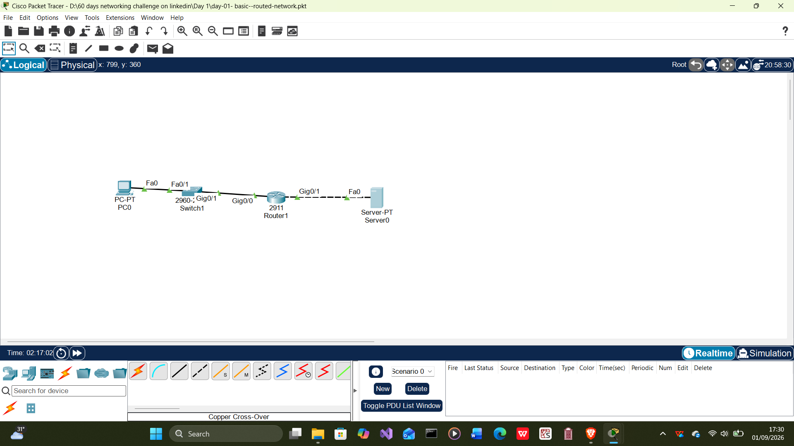
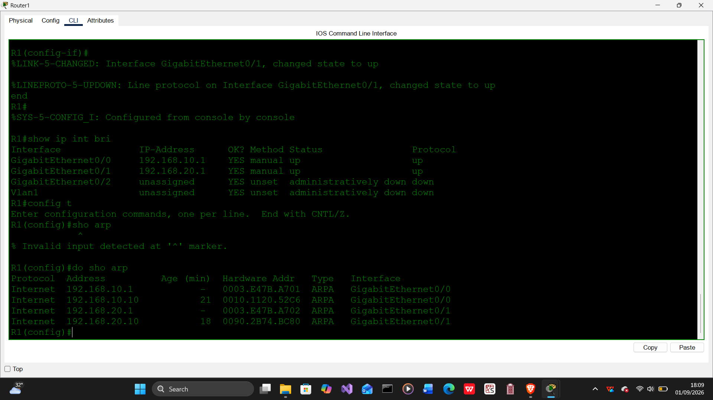

# Day 01 — Packet Tracer Fundamentals and Basic Routed Network

> Part of my **60-Day Packet Tracer and Network Engineering Portfolio Challenge**.

| Item | Details |
|---|---|
| Challenge day | 1 of 60 |
| Platform | Cisco Packet Tracer 9.0.1.0858 |
| Lab type | Basic routed network |
| Main skills | IPv4 addressing, routing, verification, Simulation mode and troubleshooting |
| Status | Completed |

## Project Overview

This lab introduces the Cisco Packet Tracer workspace and demonstrates how to connect two IPv4 networks through a router.

The topology contains a PC, a Cisco 2960 switch, a Cisco 2911 router and a server. The switch provides Layer 2 connectivity on the PC LAN, while the router forwards packets between the PC LAN and the server LAN.

## Network Topology

`PC0 → SW1 → R1 → Server0`



## Devices and Connections

| Source device | Source interface | Destination device | Destination interface | Cable |
|---|---|---|---|---|
| PC0 | FastEthernet0 | SW1 | FastEthernet0/1 | Copper straight-through |
| SW1 | FastEthernet0/24 | R1 | GigabitEthernet0/0 | Copper straight-through |
| R1 | GigabitEthernet0/1 | Server0 | FastEthernet0 | Copper crossover or automatic connection |

## IPv4 Addressing Table

| Device | Interface | IPv4 address | Subnet mask | Default gateway |
|---|---|---|---|---|
| PC0 | FastEthernet0 | `192.168.10.10` | `255.255.255.0` | `192.168.10.1` |
| R1 | GigabitEthernet0/0 | `192.168.10.1` | `255.255.255.0` | Not applicable |
| R1 | GigabitEthernet0/1 | `192.168.20.1` | `255.255.255.0` | Not applicable |
| Server0 | FastEthernet0 | `192.168.20.10` | `255.255.255.0` | `192.168.20.1` |

### Networks

- PC LAN: `192.168.10.0/24`
- Server LAN: `192.168.20.0/24`

Both networks are directly connected to R1, so an additional static route is not required.

## Why SW1 Has No IP Address

SW1 is operating as a Layer 2 switch. It forwards Ethernet frames by learning MAC addresses, so it does not require an IP address for normal switching.

A switch IP address is used for management—for example, when accessing the switch through SSH. Switch management will be covered in a later lab.

## Router Configuration

```text
enable
configure terminal
hostname R1

interface gigabitEthernet0/0
ip address 192.168.10.1 255.255.255.0
no shutdown
exit

interface gigabitEthernet0/1
ip address 192.168.20.1 255.255.255.0
no shutdown
exit

end
copy running-config startup-config
```

[View the saved router configuration](Routerconfig.txt)


> Depending on the selected router, the interfaces may instead be named `GigabitEthernet0/0/0` and `GigabitEthernet0/0/1`.

## Interface Verification

The following command was used to confirm the IP addresses and operational status of the router interfaces:

```text
show ip interface brief
```


Additional verification commands included:

```text
show ip route
show arp
show running-config
```

## Connectivity Verification

ICMP ping tests were used to verify communication across both networks.

### PC0 Ping Test


### Server0 Ping Test


## ARP Investigation

ARP was examined to understand how a device discovers the MAC address associated with an IPv4 address on its local network.



## Packet Tracer Simulation Mode

Simulation mode was used to inspect ARP and ICMP packets as they travelled through the topology.

The expected sequence was:

1. ARP request
2. ARP reply
3. ICMP echo request
4. Packet forwarding by R1
5. ICMP echo reply

### Simulation Step 1


### Simulation Step 2


### Simulation Step 3


## Troubleshooting Exercise

The R1 interface connected to Server0 was deliberately disabled:

```text
configure terminal
interface gigabitEthernet0/1
shutdown
end
```

The loss of connectivity was investigated with:

```text
show ip interface brief
show ip route
ping 192.168.20.10
```

The interface was restored with:

```text
configure terminal
interface gigabitEthernet0/1
no shutdown
end
```

This demonstrated that an administratively disabled router interface removes the connected network from the routing table and prevents communication with that network.

## What I Learned

- How to navigate the Packet Tracer Logical workspace.
- How to select and connect basic Cisco devices.
- How to configure static IPv4 information on end devices.
- How to configure and enable router interfaces using Cisco IOS.
- How a router connects two different IP networks.
- Why a Layer 2 switch does not require an IP address to forward frames.
- How to verify interfaces, routes, ARP entries and connectivity.
- How to observe ARP and ICMP traffic in Simulation mode.
- How to identify and repair an administratively disabled interface.

## Repository Files

```text
day-01-packet-tracer-fundamentals/
├── README.md
├── day-01-basic-routed-network.pkt
├── Routerconfig.txt
├── Screenshot (5).png
├── pc0 ping.png
├── server0 ping.png
├── simulation mode 1.png
├── simulation mode 2.png
├── simulation mode 3.png
├── topology.png
├── ip interface brief.png
└── ARP.png
```

## Skills Demonstrated

`Cisco Packet Tracer` · `IPv4 Addressing` · `Cisco IOS` · `Layer 2 Switching` · `Routing` · `ARP` · `ICMP` · `Network Verification` · `Troubleshooting`

