# Day 2/60 — Ethernet Switching and MAC Address Learning

## Overview

In this lab, I designed and tested a four-host local area network using a Cisco 2960 switch.

The investigation focused on how a Layer 2 switch learns source MAC addresses, stores them in its MAC address table and uses the information to forward Ethernet frames.

I also used Packet Tracer's Simulation mode to examine ARP broadcast and ICMP unicast traffic. To test the network systematically, I deliberately disabled the switch port connected to PC-B, investigated the resulting connectivity failure and restored communication.

## Lab objectives

- Build and cable a basic switched LAN.
- Configure static IPv4 addresses on end devices.
- Apply a basic configuration to a Cisco 2960 switch.
- Configure a management address on VLAN 1.
- Examine dynamic MAC address learning.
- Observe ARP broadcast and ICMP unicast traffic.
- Clear the dynamic MAC address table and observe relearning.
- Diagnose and restore an administratively disabled access port.

## Tools and technologies

- Cisco Packet Tracer 9.0.1.0858
- Cisco 2960 switch
- Ethernet
- IPv4
- ARP
- ICMP
- Cisco IOS CLI

## Completed topology

The topology consists of one Cisco 2960 switch and four PCs belonging to the same IPv4 subnet.

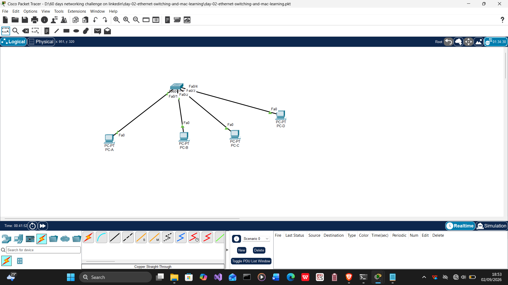

## Physical connections

| Device | Device interface | Switch | Switch interface |
|---|---|---|---|
| PC-A | FastEthernet0 | SW1 | FastEthernet0/1 |
| PC-B | FastEthernet0 | SW1 | FastEthernet0/2 |
| PC-C | FastEthernet0 | SW1 | FastEthernet0/3 |
| PC-D | FastEthernet0 | SW1 | FastEthernet0/4 |

## IPv4 addressing table

Network: `192.168.10.0/24`

| Device | Interface | IPv4 address | Subnet mask | Default gateway |
|---|---|---|---|---|
| SW1 | VLAN 1 | `192.168.10.2` | `255.255.255.0` | Not required |
| PC-A | FastEthernet0 | `192.168.10.10` | `255.255.255.0` | Not required |
| PC-B | FastEthernet0 | `192.168.10.20` | `255.255.255.0` | Not required |
| PC-C | FastEthernet0 | `192.168.10.30` | `255.255.255.0` | Not required |
| PC-D | FastEthernet0 | `192.168.10.40` | `255.255.255.0` | Not required |

A default gateway was not required because all devices belonged to the same IPv4 subnet and no router was present.

The switch management address was configured on VLAN 1. This address allows SW1 itself to be reached through the network, but it is not required for ordinary Layer 2 frame forwarding.

## Switch configuration summary

SW1 was configured with:

- Hostname `SW1`
- Management address `192.168.10.2/24`
- Management interface VLAN 1
- Console access protection
- Privileged EXEC protection
- Message-of-the-day banner
- Interface descriptions for PC-A through PC-D
- Saved startup configuration

The configuration commands and final running configuration are available in the [`configs`](configs/) folder.

## Initial MAC address table

Before test traffic was generated, I examined the dynamic MAC address table using:

```text
show mac address-table dynamic
```

The table contained no dynamically learned host entries because SW1 had not yet received traffic from the PCs.


## ARP broadcast investigation

Packet Tracer's Simulation mode was used to observe the first communication between PC-A and PC-B.

PC-A initially knew PC-B's IPv4 address but did not know its MAC address. It therefore generated an ARP request using the broadcast destination MAC address `FFFF.FFFF.FFFF`.

SW1 received the broadcast through FastEthernet0/1, learned PC-A's source MAC address and flooded the ARP request through the other active ports in VLAN 1.

### ARP simulation — Stage 1

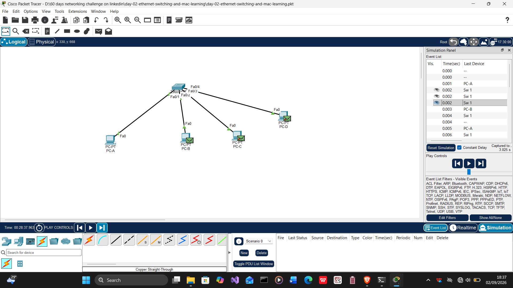

### ARP simulation — Stage 2


## ICMP unicast investigation

After PC-B replied to the ARP request, PC-A had the MAC address needed to send the ICMP echo request. The subsequent ICMP echo request and echo reply were forwarded as unicast traffic.

### ICMP simulation — Stage 1

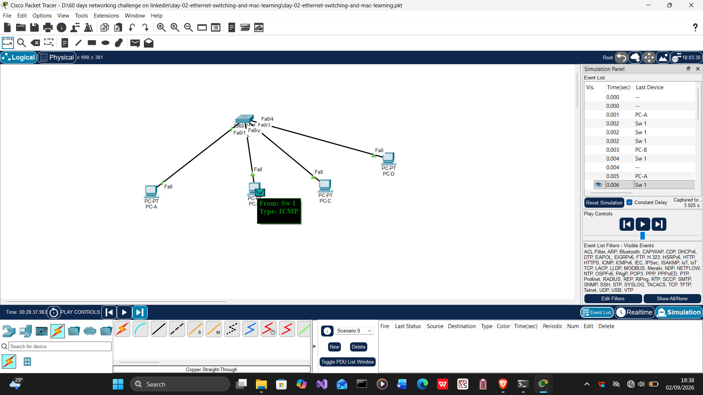

### ICMP simulation — Stage 2

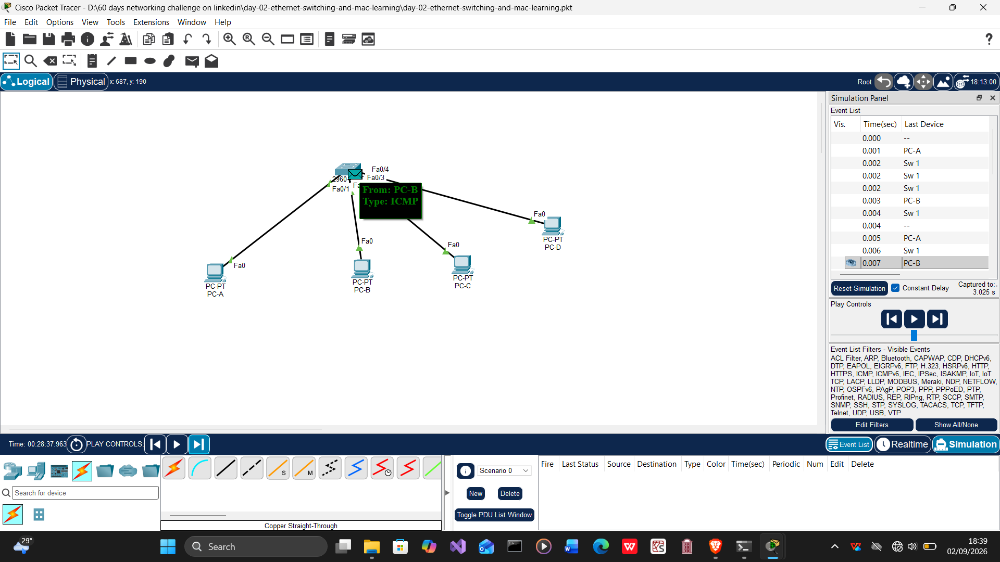

### ICMP simulation — Stage 3

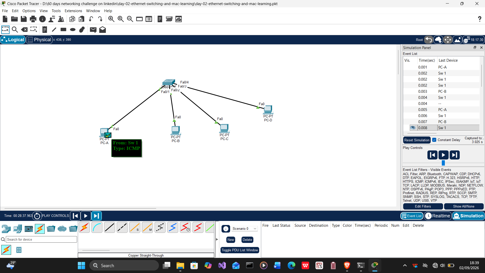

## Connectivity verification

PC-A was used to test connectivity to the SW1 management interface, PC-B, PC-C and PC-D.

```text
ping 192.168.10.2
ping 192.168.10.20
ping 192.168.10.30
ping 192.168.10.40
```

### Connectivity test — Part 1

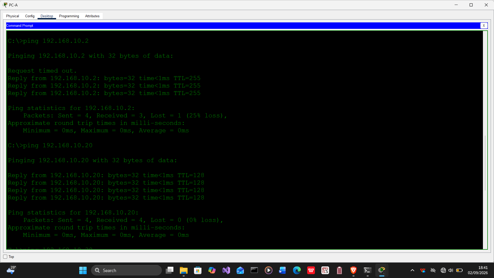

### Connectivity test — Part 2

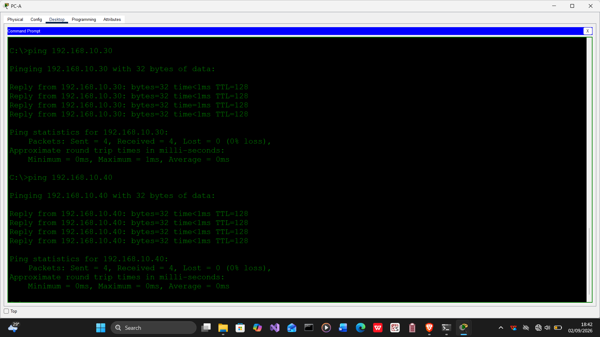

## MAC address learning

After network traffic was generated, the switch MAC address table was examined again. SW1 had learned the source MAC addresses of the connected PCs and associated each address with the interface through which its frames arrived.

```text
show mac address-table dynamic
```

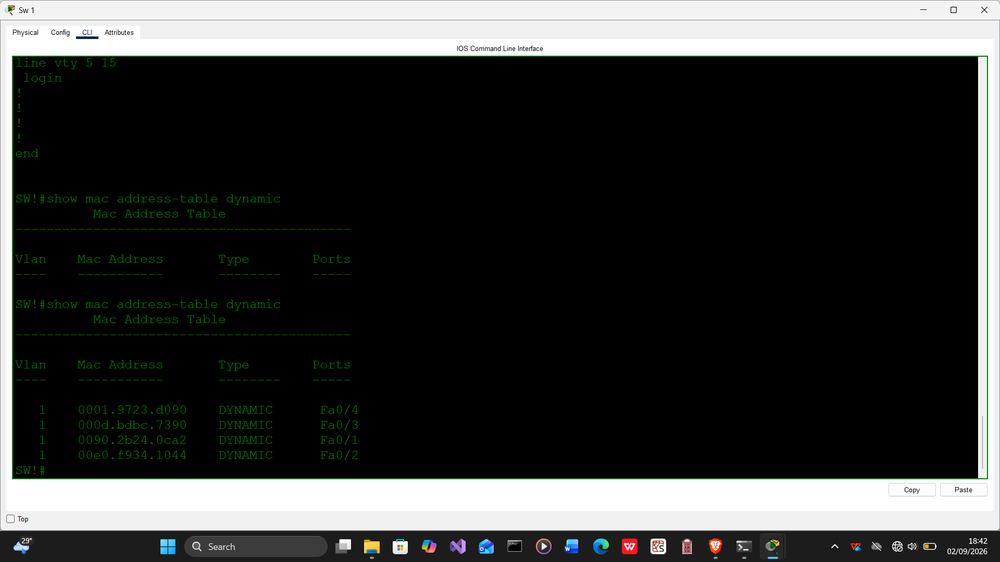

This demonstrated that a switch learns from the source MAC address of each incoming Ethernet frame.

## Switch interface verification

The management SVI and access-port conditions were verified using:

```text
show ip interface brief
show interfaces status
```

### IP interface summary

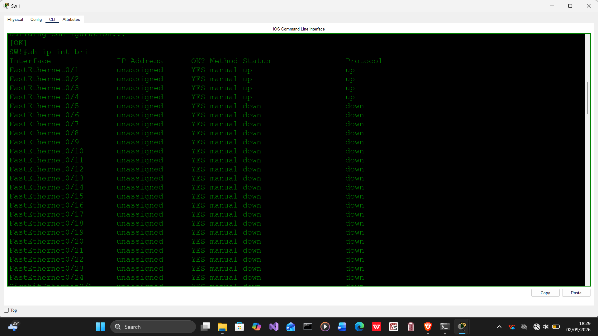

### Access-port status

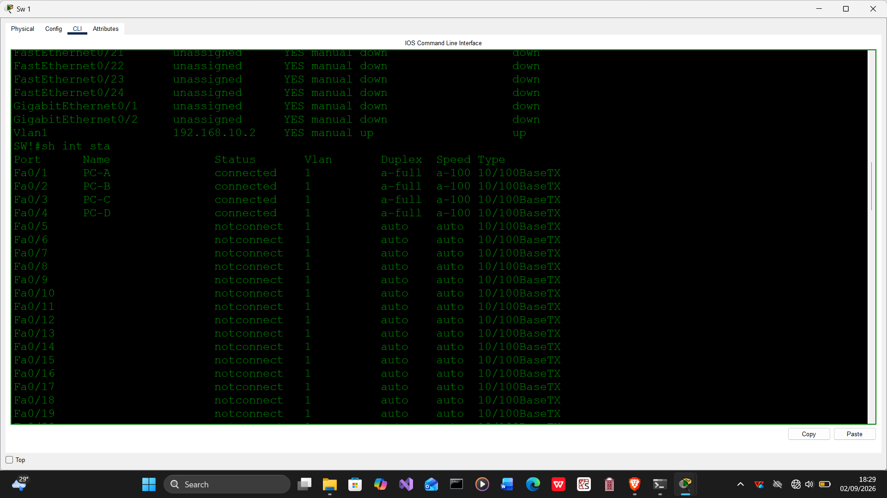

## Running configuration

The following screenshots document the final running configuration of SW1.

### Running configuration — Part 1

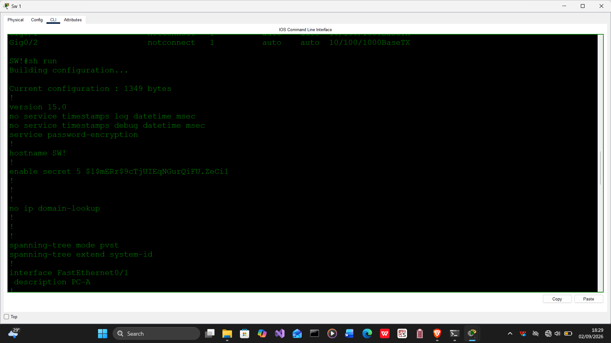

### Running configuration — Part 2

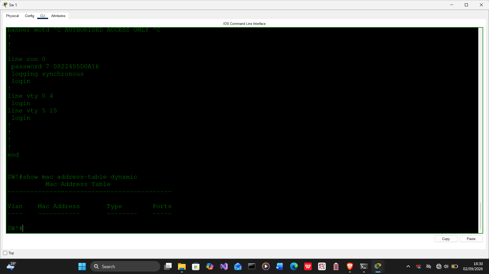

The text version is available at [`configs/sw1-running-config.txt`](configs/sw1-running-config.txt).

## MAC address relearning

The dynamic MAC address table was cleared using:

```text
clear mac address-table dynamic
```

After new network traffic was generated, SW1 relearned the required MAC-to-port mappings.

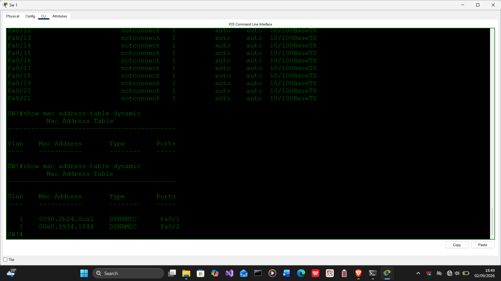

This showed that dynamic MAC address entries are not permanent. A switch can rebuild its table by examining the source MAC addresses of newly received frames.

## Deliberate troubleshooting exercise

FastEthernet0/2, which was connected to PC-B, was deliberately disabled using:

```text
configure terminal
interface fastEthernet 0/2
shutdown
end
```

Communication between PC-A and PC-B subsequently failed.

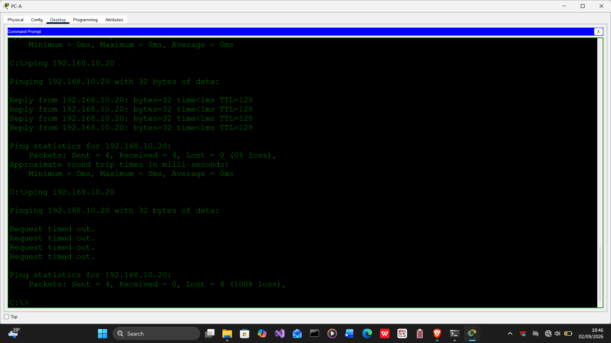

The following commands were used to investigate the fault:

```text
show interfaces status
show interfaces fastEthernet 0/2
show mac address-table dynamic
```

### Disconnected interface evidence

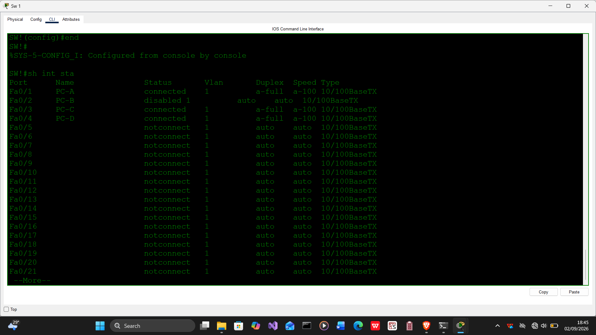

### FastEthernet0/2 investigation

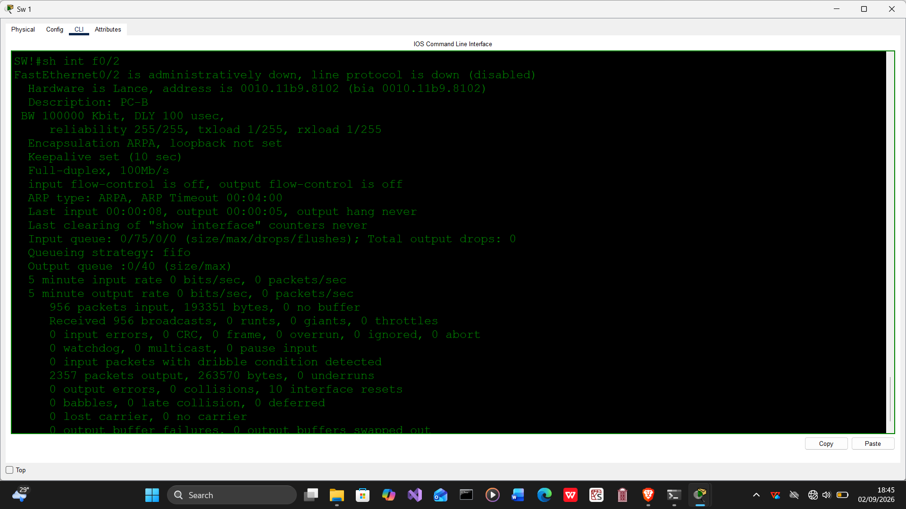

The investigation confirmed that FastEthernet0/2 was disabled or administratively down.

## Network recovery

FastEthernet0/2 was restored using:

```text
configure terminal
interface fastEthernet 0/2
no shutdown
end
```

After the port returned to an operational state, successful connectivity between PC-A and PC-B was verified using `ping`.

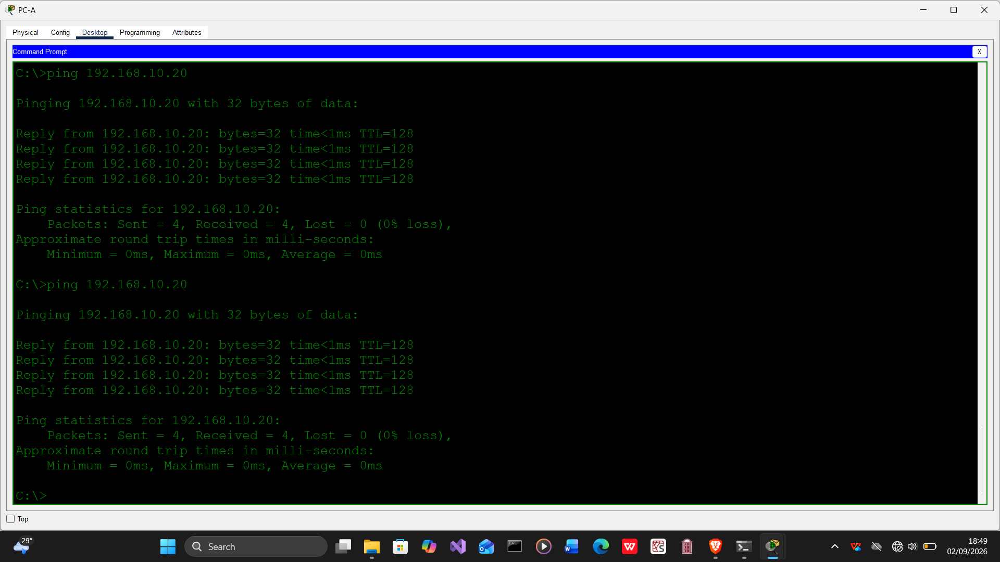

## Important commands used

| Command | Purpose |
|---|---|
| `show ip interface brief` | Displays interface addresses and operational states. |
| `show interfaces status` | Displays switch-port connection and disabled states. |
| `show interfaces fastEthernet 0/2` | Displays detailed information about FastEthernet0/2. |
| `show mac address-table dynamic` | Displays dynamically learned MAC addresses. |
| `show mac address-table interface fa0/1` | Filters the MAC address table by interface. |
| `clear mac address-table dynamic` | Removes dynamically learned MAC address entries. |
| `show running-config` | Displays the active switch configuration. |
| `copy running-config startup-config` | Saves the active configuration. |
| `shutdown` | Administratively disables an interface. |
| `no shutdown` | Administratively enables an interface. |

## Results

| Test | Result |
|---|---|
| SW1 management interface configuration | Successful |
| PC-A to PC-B, PC-C and PC-D connectivity | Successful |
| ARP broadcast observation | Successful |
| ICMP unicast observation | Successful |
| Dynamic MAC address learning | Successful |
| MAC address clearing and relearning | Successful |
| Deliberate port-failure diagnosis | Successful |
| Port restoration and final verification | Successful |

## Key lessons

- A switch learns from the source MAC address of incoming Ethernet frames.
- An ARP request is broadcast throughout the local VLAN.
- Known unicast traffic is forwarded only through the port associated with the destination MAC address.
- Devices in the same IPv4 subnet can communicate without a router.
- A switch does not require a management IP address to forward Layer 2 traffic.
- Clearing the dynamic MAC address table does not permanently remove connectivity because the switch can relearn the addresses.
- An administratively disabled access port prevents communication through that port.
- Connectivity must be tested again after applying a corrective action.

## Repository contents

| File or folder | Description |
|---|---|
| `README.md` | Complete Day 2 lab documentation |
| `day-02-ethernet-switching-and-mac-learning.pkt` | Completed Packet Tracer lab |
| `configs/` | Switch commands and final running configuration |
| `notes/` | Command explanations and troubleshooting record |
| `screenshots/` | Complete visual evidence from the lab |

## Reflection

This lab demonstrated that Ethernet switching is an active learning process. SW1 built and updated its forwarding information from the source MAC addresses of the frames it received.

The deliberate failure also reinforced the importance of checking interface states and verifying connectivity after corrective action.

My approach throughout this challenge remains:

> **Build, break, investigate and verify.**

