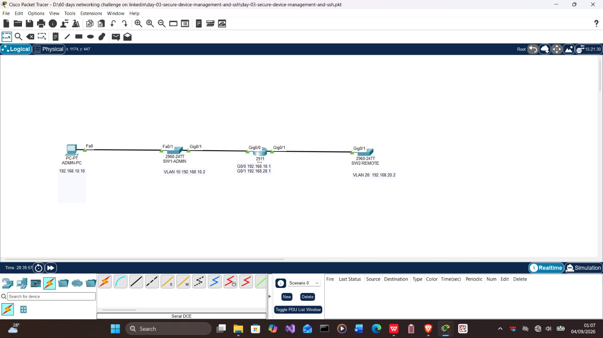

# Day 3/60 — Secure Device Management and SSH

This lab is part of my **60-Day Packet Tracer Network Engineering Challenge**. It demonstrates secure remote administration across two IPv4 subnets using a Cisco 2911 router, two Cisco 2960 switches, management VLANs, local authentication and SSH version 2.

My working method throughout the challenge is: **build, break, investigate and verify**.



## Lab Overview

| Item | Details |
|---|---|
| Challenge | Day 3 of 60 |
| Topic | Secure device management and SSH |
| Simulator | Cisco Packet Tracer 9.0.1.0858 |
| Router | Cisco 2911 |
| Switches | Two Cisco 2960-24TT switches |
| Administration host | One PC-PT |
| IPv4 networks | `192.168.10.0/24` and `192.168.20.0/24` |
| Management protocol | SSH version 2 |

## Objectives

- Build and address two routed IPv4 networks.
- Configure switch management VLANs and switched virtual interfaces (SVIs).
- Configure the correct Layer 2 switch default gateways.
- Secure privileged, console and remote administrative access.
- Create a local administrator and enable SSH version 2.
- Restrict VTY access to SSH only.
- Verify local and remote management connectivity.
- Introduce a missing-default-gateway fault and prove its effect.
- Introduce an incorrect-VTY-transport fault and restore SSH-only access.
- inspect ICMP forwarding and SSH traffic in Simulation mode.

## Topology and Addressing

| Device | Interface | IPv4 address | Mask | Default gateway | Role |
|---|---|---:|---:|---:|---|
| ADMIN-PC | FastEthernet0 | `192.168.10.10` | `255.255.255.0` | `192.168.10.1` | Management workstation |
| SW1-ADMIN | VLAN 10 SVI | `192.168.10.2` | `255.255.255.0` | `192.168.10.1` | Local switch management |
| R1 | GigabitEthernet0/0 | `192.168.10.1` | `255.255.255.0` | Not required | Gateway for VLAN 10 |
| R1 | GigabitEthernet0/1 | `192.168.20.1` | `255.255.255.0` | Not required | Gateway for VLAN 20 |
| SW2-REMOTE | VLAN 20 SVI | `192.168.20.2` | `255.255.255.0` | `192.168.20.1` | Remote switch management |

Both networks are directly connected to R1, so no static or dynamic routing protocol is required for this topology.

## Physical Connections

| From | Port | To | Port | Media |
|---|---|---|---|---|
| ADMIN-PC | Fa0 | SW1-ADMIN | Fa0/1 | Copper straight-through |
| SW1-ADMIN | Gi0/1 | R1 | Gi0/0 | Copper straight-through |
| R1 | Gi0/1 | SW2-REMOTE | Gi0/1 | Copper straight-through |

## Implementation Summary

### Router R1

- Configured `G0/0` as `192.168.10.1/24`.
- Configured `G0/1` as `192.168.20.1/24`.
- Enabled both interfaces with `no shutdown`.
- Created the local `netadmin` administrative account.
- Configured a domain name and generated RSA keys.
- Forced SSH version 2 and restricted VTY access to SSH.
- Applied a login banner and idle-session timeout.

### Switch SW1-ADMIN

- Created management VLAN 10.
- Assigned `Fa0/1` and `Gi0/1` to VLAN 10 as access ports.
- Configured the VLAN 10 SVI as `192.168.10.2/24`.
- Set `192.168.10.1` as the default gateway.
- Enabled local authentication and SSH-only VTY access.

### Switch SW2-REMOTE

- Created management VLAN 20.
- Assigned `Gi0/1` to VLAN 20 as an access port.
- Configured the VLAN 20 SVI as `192.168.20.2/24`.
- Set `192.168.20.1` as the default gateway.
- Enabled local authentication and SSH-only VTY access.

## Verification

The following destinations were tested from ADMIN-PC:

```text
ping 192.168.10.1
ping 192.168.10.2
ping 192.168.20.1
ping 192.168.20.2
```

SSH was tested with:

```text
ssh -l netadmin 192.168.10.1
ssh -l netadmin 192.168.10.2
ssh -l netadmin 192.168.20.2
```

Successful remote management confirmed all three requirements:

1. The IP path was reachable.
2. Each managed device had a valid return path.
3. SSH was enabled and accepted by the VTY lines.

## Controlled Fault 1 — Missing Default Gateway

The default gateway was deliberately removed from SW2-REMOTE.

| Observation | Meaning |
|---|---|
| R1 could still ping `192.168.20.2` | R1 and SW2 remained directly connected on the same subnet. |
| ADMIN-PC could not ping or SSH to `192.168.20.2` | SW2 lacked a return path to `192.168.10.0/24`. |
| Access returned after restoring `ip default-gateway 192.168.20.1` | The fault and corrective action were verified. |

## Controlled Fault 2 — Incorrect VTY Transport

SW2-REMOTE was temporarily changed to accept Telnet instead of SSH.

| Observation | Meaning |
|---|---|
| Ping continued to succeed | Layer 3 connectivity remained operational. |
| SSH failed | The failure was at the management-service layer, not the IP layer. |
| Telnet became available during the fault | The VTY transport configuration caused the behaviour. |
| `transport input ssh` restored secure access and blocked Telnet | The service was repaired and hardened. |

## Simulation-Mode Findings

- ADMIN-PC created an ICMP Echo Request with source `192.168.10.10` and destination `192.168.20.2`.
- SW1 forwarded the Ethernet frame at Layer 2.
- R1 routed the packet from `G0/0` to `G0/1` and rewrote the Layer 2 header for the next segment.
- SW2 received the request and generated an ICMP Echo Reply.
- The reply followed the reverse routed path to ADMIN-PC.
- SSH traffic was identified at Layer 7 and carried by TCP destination port `22`.

## Evidence Guide

| Folder | Evidence |
|---|---|
| [`screenshots/01-topology`](screenshots/01-topology/) | Labelled devices, ports, VLANs and addresses |
| [`screenshots/02-router-and-routing`](screenshots/02-router-and-routing/) | Router interface and connected-route verification |
| [`screenshots/03-connectivity-and-ssh`](screenshots/03-connectivity-and-ssh/) | Ping and successful SSH sessions |
| [`screenshots/04-default-gateway-troubleshooting`](screenshots/04-default-gateway-troubleshooting/) | Fault, isolation, correction and recovery |
| [`screenshots/05-telnet-troubleshooting`](screenshots/05-telnet-troubleshooting/) | VTY transport fault and SSH-only restoration |
| [`screenshots/06-icmp-simulation`](screenshots/06-icmp-simulation/) | ICMP request and reply across the topology |
| [`screenshots/07-ssh-simulation`](screenshots/07-ssh-simulation/) | SSH application traffic and TCP port 22 |

## Repository Structure

```text
day-03-secure-device-management-and-ssh/
├── README.md
├── packet-tracer/
│   ├── README.md
│   └── day-03-secure-device-management-and-ssh.pkt
├── configs/
│   ├── README.md
│   ├── r1-reference-config.txt
│   ├── sw1-admin-reference-config.txt
│   └── sw2-remote-reference-config.txt
├── documentation/
│   ├── README.md
│   ├── addressing-table.md
│   ├── command-reference.md
│   ├── folder-structure.md
│   ├── linkedin-post.md
│   ├── screenshot-index.md
│   ├── troubleshooting-log.md
│   └── verification-checklist.md
└── screenshots/
    ├── README.md
    ├── 01-topology/
    ├── 02-router-and-routing/
    ├── 03-connectivity-and-ssh/
    ├── 04-default-gateway-troubleshooting/
    ├── 05-telnet-troubleshooting/
    ├── 06-icmp-simulation/
    └── 07-ssh-simulation/
```

Every directory contains its own `README.md` explaining its purpose and files.

## Security and Evidence Notes

- Credentials in the Packet Tracer lab are disposable training credentials and must never be reused elsewhere.
- Public text configurations use placeholders instead of passwords or password hashes.
- Two original configuration screenshots were deliberately excluded because they displayed reversible Cisco Type 7 password strings.
- Minor cosmetic naming and banner inconsistencies in the captured lab do not affect routing, reachability or SSH operation; they are recorded in the troubleshooting notes to preserve the original evidence honestly.

## Key Learning Outcome

Ping success proves IP reachability, but it does not prove that an application service is correctly configured. Secure remote administration depends on working addressing and routing, a valid return path, correct authentication, cryptographic prerequisites and the intended VTY transport policy.

Special appreciation to **Cophild Consult** as I continue strengthening my practical networking competence.
