# Day 04 - VLAN Segmentation and 802.1Q Trunking

> Part of my **60-Day Packet Tracer and Network Engineering Portfolio Challenge**.

| Item | Details |
|---|---|
| Challenge day | 4 of 60 |
| Platform | Cisco Packet Tracer 9.0.1.0858 |
| Lab type | Layer 2 VLAN segmentation and inter-switch trunking |
| Main skills | VLANs, access ports, 802.1Q trunks, native VLANs, management SVIs, SSH, MAC-table analysis and troubleshooting |
| Status | Completed |

## Project Overview

This lab demonstrates how VLANs divide one physical switched network into separate Layer 2 broadcast domains. Two Cisco 2960 switches were connected with an 802.1Q trunk so devices in the same VLAN could communicate across both switches.

The final design uses VLAN 10 for staff devices, VLAN 20 for guest devices, VLAN 99 for switch management and VLAN 999 as the unused/native black-hole VLAN. No router or multilayer switch was included, so communication between different VLANs was expected to fail.

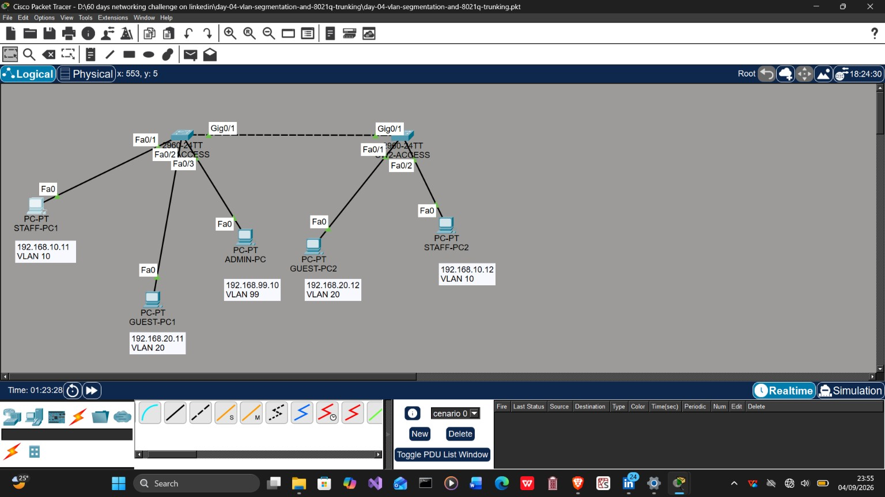

## Objectives

- Create and name VLANs 10, 20, 99 and 999 on both switches.
- Assign user-facing interfaces as static access ports.
- Configure the inter-switch link as an 802.1Q trunk.
- Allow only VLANs 10, 20, 99 and 999 across the trunk.
- Change the trunk native VLAN from VLAN 1 to VLAN 999.
- Park unused interfaces in VLAN 999 and shut them down.
- Configure management SVIs and verify SSH access.
- Confirm same-VLAN communication across switches.
- Confirm that different VLANs remain isolated without inter-VLAN routing.
- Diagnose both accidental and deliberately introduced faults.

## VLAN Plan

| VLAN | Name | Purpose | IPv4 network | Active access ports |
|---|---|---|---|---|
| 10 | STAFF | Staff endpoints | `192.168.10.0/24` | SW1 Fa0/1, SW2 Fa0/1 |
| 20 | GUEST | Guest endpoints | `192.168.20.0/24` | SW1 Fa0/2, SW2 Fa0/2 |
| 99 | MANAGEMENT | Switch administration | `192.168.99.0/24` | SW1 Fa0/3 and both switch SVIs |
| 999 | NATIVE-BLACKHOLE | Native VLAN and unused ports | No user subnet | Unused access ports and trunk native VLAN |

## Addressing Table

| Device | Interface | IPv4 address | VLAN | Role |
|---|---|---|---|---|
| STAFF-PC1 | FastEthernet0 | `192.168.10.11/24` | 10 | Staff endpoint on SW1 |
| STAFF-PC2 | FastEthernet0 | `192.168.10.12/24` | 10 | Staff endpoint on SW2 |
| GUEST-PC1 | FastEthernet0 | `192.168.20.11/24` | 20 | Guest endpoint on SW1 |
| GUEST-PC2 | FastEthernet0 | `192.168.20.12/24` | 20 | Guest endpoint on SW2 |
| ADMIN-PC | FastEthernet0 | `192.168.99.10/24` | 99 | Management workstation |
| SW1-ACCESS | VLAN 99 SVI | `192.168.99.2/24` | 99 | Switch management |
| SW2-ACCESS | VLAN 99 SVI | `192.168.99.3/24` | 99 | Switch management |

Default gateways were not required for the tests in this lab because each successful communication path remained inside one IP subnet and VLAN.

## Switch Configuration

The reusable core configurations are provided here:

- [SW1-ACCESS configuration](configs/sw1-access-config.txt)
- [SW2-ACCESS configuration](configs/sw2-access-config.txt)

The important trunk configuration applied to `GigabitEthernet0/1` on both switches was:

```text
switchport mode trunk
switchport trunk native vlan 999
switchport trunk allowed vlan 10,20,99,999
```

The trunk was verified with:

```text
show interfaces trunk
show interfaces gigabitEthernet0/1 switchport
```

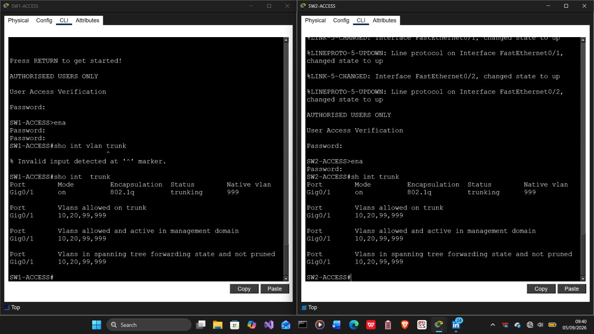

## Connectivity Results

| Test | Expected result | Observed result |
|---|---|---|
| STAFF-PC1 to STAFF-PC2 | Success across the trunk in VLAN 10 | Successful |
| GUEST-PC1 to GUEST-PC2 | Success across the trunk in VLAN 20 | Successful after the cabling correction |
| ADMIN-PC to `192.168.99.2` | Success within VLAN 99 | Successful |
| ADMIN-PC to `192.168.99.3` | Success across the trunk in VLAN 99 | Successful |
| Staff VLAN to Guest VLAN | Failure because no inter-VLAN routing exists | Failed as designed |

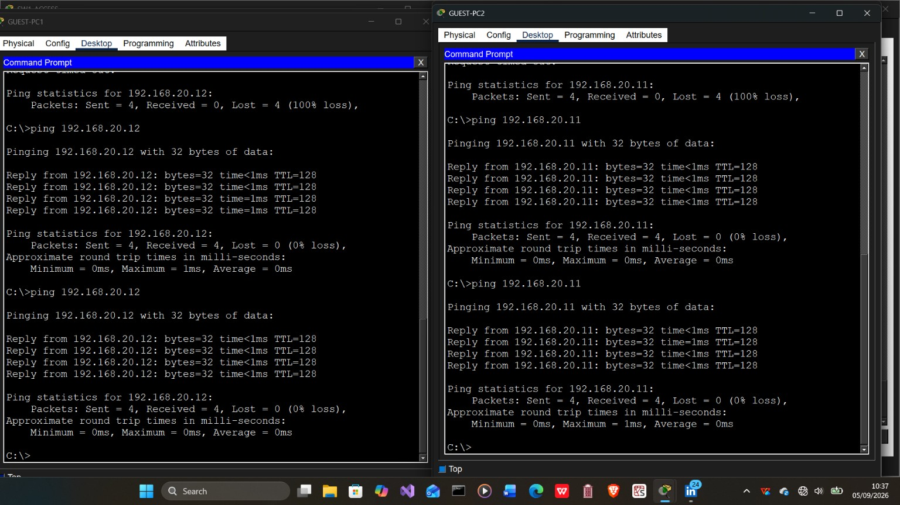

## The Unexpected Issue and How It Was Fixed

The most useful part of the lab came from an accidental physical-layer mistake.

### Symptom

`GUEST-PC1` (`192.168.20.11`) could not ping `GUEST-PC2` (`192.168.20.12`). Both devices had addresses in the same `/24` subnet, VLAN 20 existed on both switches and VLAN 20 was allowed across the trunk, but the ping still returned 100% packet loss.

### Investigation

The following checks were used:

```text
show vlan brief
show interfaces trunk
show mac address-table dynamic
```

The decisive evidence came from the SW2 MAC address table. The MAC address belonging to `GUEST-PC2`, `00e0.8f2e.99e3`, was learned on `Fa0/1` under VLAN 10.

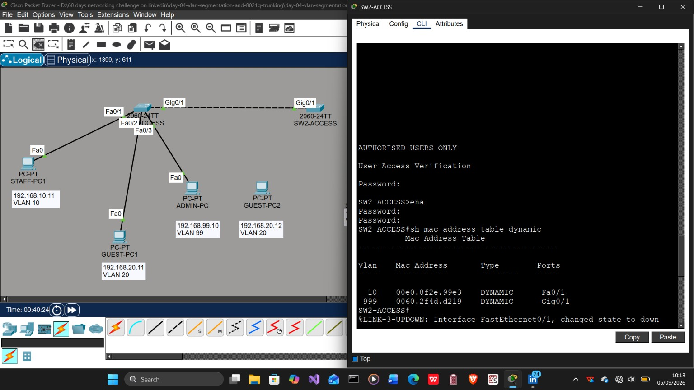

### Root Cause

`GUEST-PC2` had been physically connected to SW2 `Fa0/1`. That interface was correctly configured as the staff access port in VLAN 10, but the guest PC was supposed to use `Fa0/2` in VLAN 20. The switch therefore classified the guest PC's untagged frames as VLAN 10 traffic.

### Resolution

The endpoint cables were corrected:

| Endpoint | Correct SW2 interface | Access VLAN |
|---|---|---|
| STAFF-PC2 | Fa0/1 | 10 |
| GUEST-PC2 | Fa0/2 | 20 |

After reconnecting the endpoints, the guest PCs exchanged ICMP replies successfully with 0% packet loss.

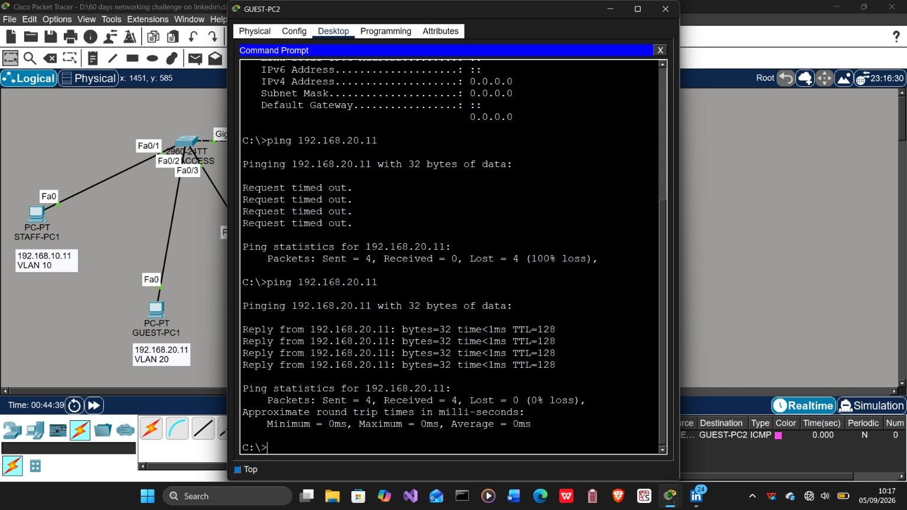

A detailed incident record is available in [notes/troubleshooting.md](notes/troubleshooting.md).

## Deliberate Break-and-Fix Tests

After establishing a working baseline, two additional faults were introduced deliberately.

### Wrong Access VLAN

SW2 `Fa0/1` was temporarily moved from VLAN 10 to VLAN 20. This caused the two staff PCs to lose connectivity even though their IP addresses remained in the same subnet. `show interfaces fa0/1 switchport` exposed the incorrect access VLAN, and the port was restored with:

```text
interface fastEthernet0/1
switchport access vlan 10
```

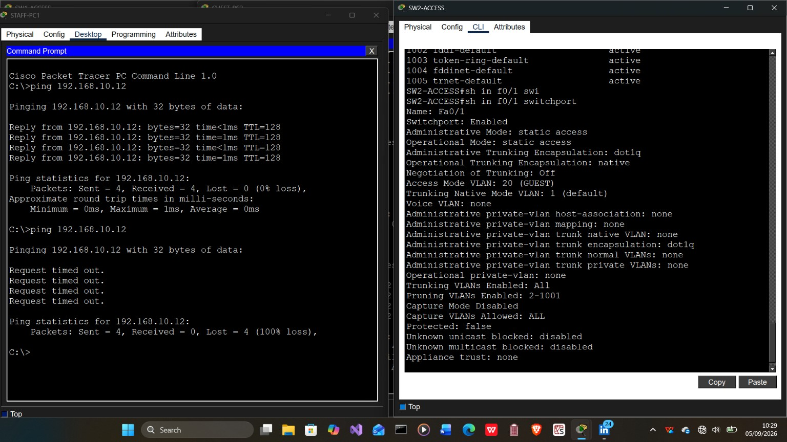

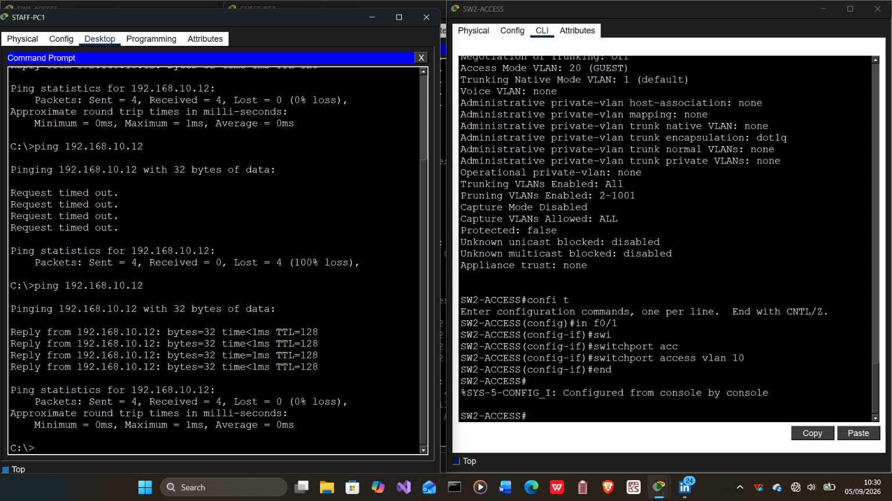

### VLAN 20 Removed From the Trunk

VLAN 20 was temporarily removed from the trunk allow-list. Guest communication across the switches failed, while VLAN 10 staff communication continued to work. This isolated the fault to the VLAN-specific trunk configuration rather than to the physical trunk itself.

The required allow-list was restored with:

```text
interface gigabitEthernet0/1
switchport trunk allowed vlan 10,20,99,999
```

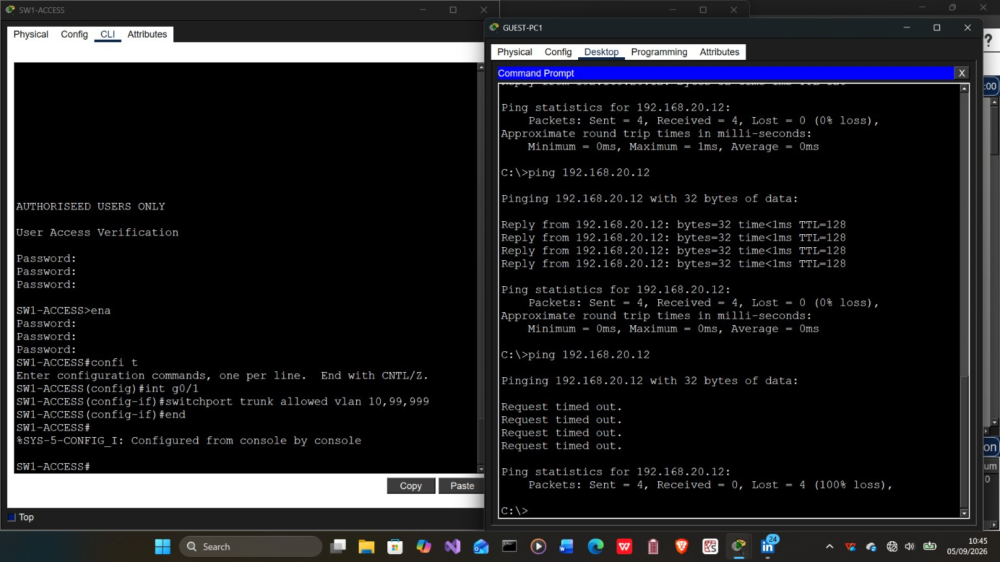

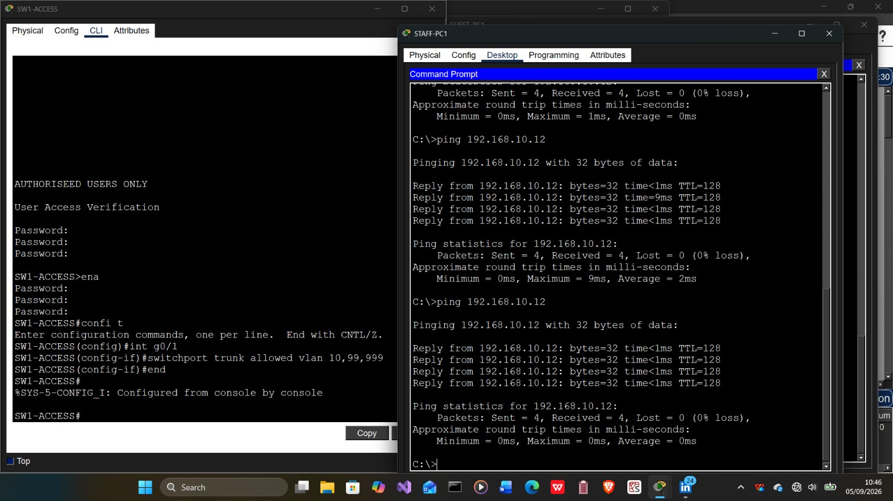

## Management and SSH Verification

`ADMIN-PC` successfully reached both VLAN 99 switch management addresses and opened SSH sessions to both switches using the locally configured account.

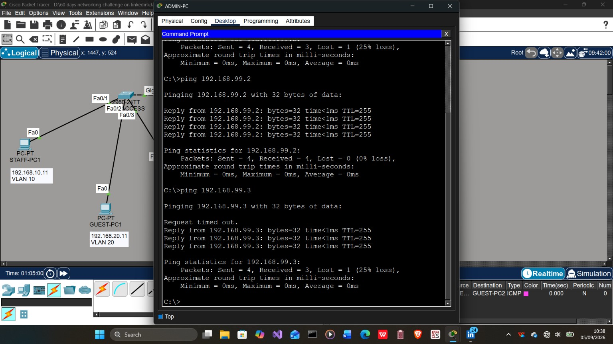

## Simulation Mode

Packet Tracer Simulation mode was used to follow ICMP traffic through the topology. Same-VLAN frames crossed the 802.1Q trunk successfully. Cross-VLAN traffic failed because no Layer 3 device was present to route between VLAN 10 and VLAN 20.

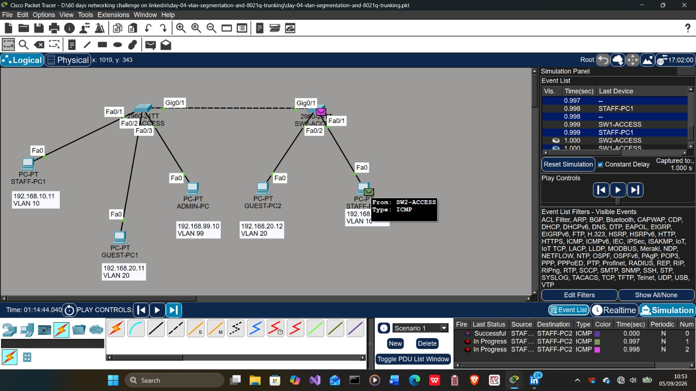

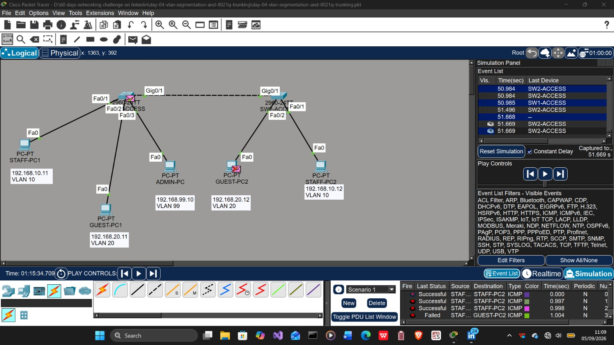

## Verification Commands

```text
show vlan brief
show interfaces status
show interfaces trunk
show interfaces gigabitEthernet0/1 switchport
show ip interface brief
show mac address-table dynamic
ping <destination-ip>
```

## Repository Structure

```text
day-04-vlan-segmentation-and-8021q-trunking/
|-- README.md
|-- Day-04-Lab-Documentation.docx
|-- day-04-vlan-segmentation-and-8021q-trunking.pkt
|-- configs/
|   |-- README.md
|   |-- sw1-access-config.txt
|   `-- sw2-access-config.txt
|-- notes/
|   |-- README.md
|   `-- troubleshooting.md
|-- screenshots/
|   |-- README.md (original-to-new filename map)
|   `-- 24 numbered PNG screenshots
`-- social/
    |-- README.md
    `-- linkedin-post.md
```

## What I Learned

- VLAN membership is determined by the ingress switchport, not by the endpoint's IP address.
- Two hosts can share an IP subnet and still fail to communicate when their switchports belong to different VLANs.
- A trunk can remain operational while traffic for one omitted VLAN fails.
- The MAC address table can reveal the physical port and VLAN on which an endpoint is being learned.
- Same-VLAN traffic can cross an 802.1Q trunk without a router.
- Communication between different VLANs requires inter-VLAN routing.
- A disciplined workflow of **build, break, investigate, fix and verify** makes troubleshooting repeatable.

## Skills Demonstrated

`Cisco Packet Tracer` · `VLAN Segmentation` · `802.1Q Trunking` · `Access Ports` · `Native VLAN Security` · `Management SVI` · `SSH` · `MAC Address Tables` · `ICMP` · `Network Troubleshooting`
